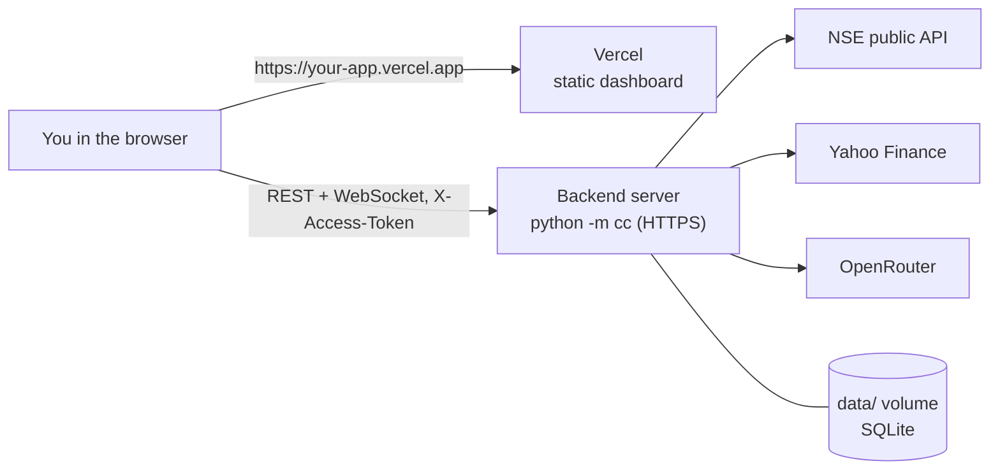

# Deployment: Vercel dashboard + always-on backend

## The short version

| Piece | Where | Why |
|---|---|---|
| Dashboard (`web/`) | **Vercel** | a static React build; fast, free tier, preview deployments |
| Backend (`backend/` + `packages/tradingagents`) | **an always-on server** (VPS or Docker host, ideally in India) | runs a continuous monitor loop, holds WebSocket connections, stores SQLite data, runs 10-minute AI jobs |

The dashboard calls the backend over HTTPS with your access token.



## Why the backend can't run on Vercel

These points come from Vercel's documentation as of August 2026 (Functions limits, the Python runtime, WebSockets, and
Docker on Vercel).

| The backend needs | Vercel Functions (including container images) |
|---|---|
| A market monitor that runs every 30 s all day | Request-scoped: "each instance takes a request, returns a response, and keeps nothing between calls"; scales to zero after 5 min without traffic; no background processes |
| AI agent runs of about 10 min per analyst | Max duration 300 s on Hobby; 800 s on Pro (1800 s beta) |
| One in-memory event bus pushing to all dashboards over WebSocket | WebSockets are pinned to one function for its max duration; later connections may reach another instance |
| SQLite on disk (signals, alerts, runs, paper orders) | Stateless; state must live in an external database |
| Reliable NSE access | Default region `iad1` (US). NSE's public site often rejects cloud/overseas IPs |

Running the backend there would need a rewrite: an external database and queue, and a separate scheduler for the
monitor. Hosting the backend on an always-on server keeps the code as it is.

---

## Step 1: deploy the backend

Pick **one** option.

### First: test the host with the preflight

NSE's public site often refuses cloud and overseas IP addresses, so check a server **before** you commit to it. On the
server (or any machine), from the repository root:

```bash
.venv/bin/python -m cc --check        # Windows: .venv\Scripts\python.exe -m cc --check
```

It prints PASS / WARN / FAIL for the configuration (access token, dev mode, CORS, AI key, data folder, built
dashboard) and for live access to NSE quotes and option chains, Yahoo, the NSE reference lists and the AI model list.
It makes no AI calls and exits non-zero when anything fails. If the NSE lines fail on a server, pick another region or
provider.

### Option A: VPS in India (recommended for NSE data)

Any Ubuntu 24.04 VPS with 2 GB+ RAM in a Mumbai/Bangalore region. `deploy/` has everything:

| File | What it does |
|---|---|
| `deploy/setup-ubuntu.sh` | installs Python 3.12 and Caddy, creates the `dalalsight` service user, installs the app, sets the server values in `.env` (generates `CC_ACCESS_TOKEN` if empty), starts the service behind Caddy, runs the preflight |
| `deploy/dalalsight.service` | the systemd unit (template) |
| `deploy/Caddyfile` | HTTPS + WebSocket reverse proxy (template) |

1. Point a domain (e.g. `api.yourdomain.com`) at the VPS with a DNS A record, so Caddy can get the certificate.
2. Clone and run the setup (the repo is private, so sign in to GitHub on the server):

   ```bash
   git clone https://github.com/vikrantsingh07-ai/dalalsight.git /opt/dalalsight
   cd /opt/dalalsight
   sudo bash deploy/setup-ubuntu.sh api.yourdomain.com https://your-app.vercel.app
   ```

   Leave out the second argument if you open the dashboard from this server instead of Vercel.
3. Add your `OPENROUTER_API_KEY` to `/opt/dalalsight/.env`, then `sudo systemctl restart dalalsight`.
4. Check it:

   ```bash
   sudo grep CC_ACCESS_TOKEN /opt/dalalsight/.env
   curl -H "X-Access-Token: <token>" https://api.yourdomain.com/api/status
   journalctl -u dalalsight -f
   ```

After a `git pull`, run the setup script again; it keeps your `.env` values.

What the script writes to `.env`: `CC_HOST=127.0.0.1` (Caddy in front terminates HTTPS), `CC_PORT=8765`,
`CC_DEV_MODE=false`, `CC_CORS_ORIGINS=<dashboard origin>`, `LIVE_EXECUTION_ENABLED=false`, and a random
`CC_ACCESS_TOKEN` when none is set.

### Option B: Docker host (Render, Railway, Fly.io, …)

The repository's `Dockerfile` builds the API and the dashboard into one image.

> **Not tested yet:** the image hasn't been built on the development PC because Docker isn't installed there. The first build runs on the host.

1. Create a web service from the GitHub repo using the root `Dockerfile`. Choose an Asia/India region if offered.
2. Environment variables:
   - `CC_ACCESS_TOKEN` (long random), `CC_CORS_ORIGINS=https://your-app.vercel.app`
   - `OPENROUTER_API_KEY`, `TRADINGAGENTS_MARKET=india`
   - Leave `CC_PORT` empty; the platform's `PORT` is used.
3. Attach a **persistent disk at `/app/data`**, otherwise signals, alerts and runs are lost on every deploy.
4. Health check path: `/api/health` (send the token header if the platform allows; otherwise use a TCP check).

The container binds `0.0.0.0` and refuses to start without `CC_ACCESS_TOKEN`. After the first deploy, run
`python -m cc --check` in the platform's shell to confirm the host can reach NSE. The image includes the bundled NSE
reference snapshot (`backend/cc/data/reference_seed/`), so lot sizes and the equity list still work if NSE refuses the
first download; System Health then shows "Reference data: DEGRADED" with the snapshot date until a download succeeds.

## Step 2: deploy the dashboard on Vercel

**Dashboard (easiest):**
1. vercel.com → **Add New… → Project** → import `vikrantsingh07-ai/dalalsight`. The repo is private, so allow
   the Vercel GitHub app to access it.
2. **Root Directory:** `web`. The framework (Vite), build command and output come from `web/vercel.json`.
3. **Environment Variables:**
   - `VITE_API_BASE_URL` = `https://api.yourdomain.com` (your backend, no trailing slash)
   - Optional: `VITE_WS_URL` = `wss://api.yourdomain.com/ws`. Only needed if WebSockets use a different host.
4. **Deploy.** Note the URL, e.g. `https://your-app.vercel.app`.

**CLI alternative:**

```bash
npm i -g vercel
cd web
vercel link
vercel env add VITE_API_BASE_URL production
vercel --prod
```

> `VITE_*` values are compiled into public JavaScript. Put **only** the backend URL there, never an API key or the
> access token.

## Step 3: connect them

1. On the backend, set `CC_CORS_ORIGINS` to the exact Vercel URL(s), comma-separated, including any custom domain. Restart.
2. Open the Vercel URL. The first API call returns 401 and the dashboard asks for the **access token**. Paste
   `CC_ACCESS_TOKEN`. It's stored in that browser only.
3. Check **System Health**: API server, database, market data, AI model and WebSocket should be ONLINE.

## Alternative: one server, no Vercel

The backend already serves the built dashboard. With Option A, run `cd web && npm ci && npm run build` on the VPS, or
use the Docker image, which includes `web/dist`. Then open `https://api.yourdomain.com` directly: one URL and no CORS setup.

## Security checklist

- [ ] HTTPS everywhere (Caddy / platform TLS). Never expose port 8765 directly.
- [ ] `CC_ACCESS_TOKEN` is long and random; `CC_DEV_MODE=false`. The token also guards `/api/docs`.
- [ ] `python -m cc --check` on the server shows no FAIL lines.
- [ ] `CC_CORS_ORIGINS` lists only your dashboard URLs.
- [ ] `LIVE_EXECUTION_ENABLED=false` (live execution is not implemented and stays refused).
- [ ] `.env` is not committed; the OpenRouter key has been rotated if it was ever shared.
- [ ] Back up the `data/` directory or volume.

## Troubleshooting

| Symptom | Fix |
|---|---|
| Browser console: CORS error | `CC_CORS_ORIGINS` must match the dashboard origin exactly (scheme + host, no trailing slash); restart the backend |
| Token prompt keeps coming back | wrong token, or the backend restarted with a different `CC_ACCESS_TOKEN` |
| "Live updates disconnected" | the proxy must allow WebSocket upgrades (Caddy does); check `VITE_API_BASE_URL` / `VITE_WS_URL` |
| "Data unavailable: NSE …" on the server | NSE is rejecting the server's IP; try an Indian region, or add a broker feed adapter |
| Agent runs stop at the daily budget | raise `AI_DAILY_CALL_BUDGET`, or use a paid model |
