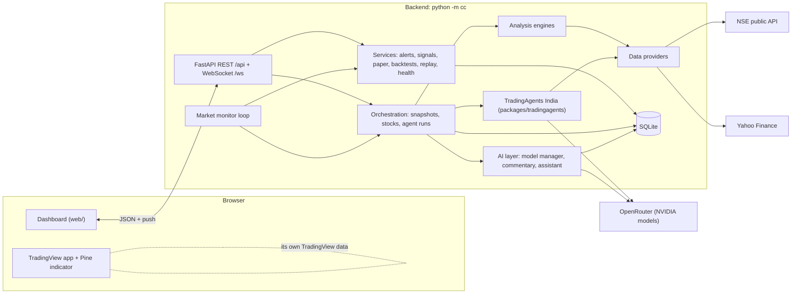
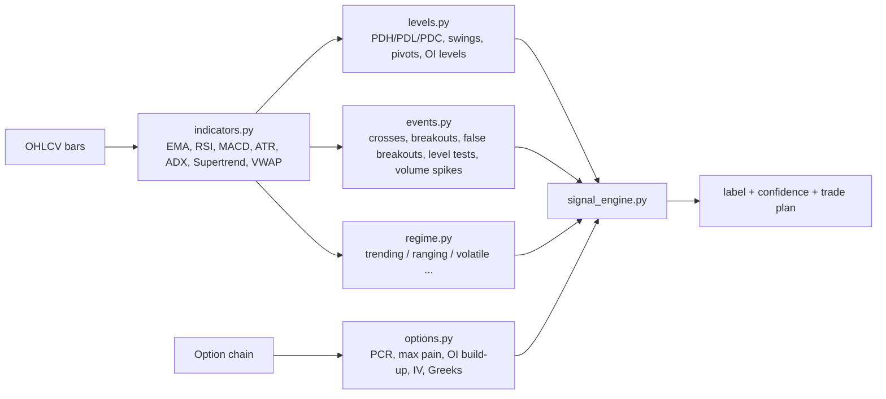
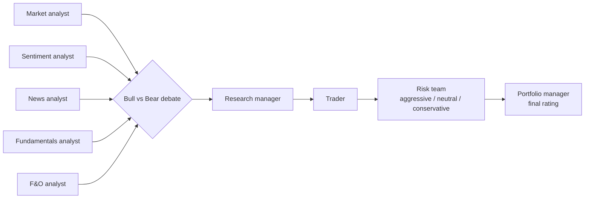

# How DalalSight works

This walks through the system from the moment the server starts to what you see on screen. File paths are relative to
the repository root.

## 1. The big picture

The dashboard never talks to NSE, Yahoo or the AI provider directly. Everything goes through the backend, which holds
the keys. TradingView runs separately in your TradingView app with the Pine indicator.

## 2. Startup

`python -m cc` (`backend/cc/__main__.py`) does the following:

1. Loads `.env` from the repo root, then `packages/tradingagents/.env` if present (`config.load_environment`). Process
   environment variables win.
2. Builds `EnvConfig`. It **refuses to start** on a non-local address without `CC_ACCESS_TOKEN`.
3. `api/container.build_services` wires everything:
   - opens SQLite and runs migrations
   - creates the composite data provider, the model manager, the settings store and the services
   - marks jobs left "running" by a previous crash as failed
4. `api/app.create_app` adds:
   - the token guard
   - CORS for `CC_CORS_ORIGINS`
   - JSON error handlers (`DataUnavailable` → 503, `ExecutionRefused` → 403, validation → 422)
   - the routes and `/ws`
   - the built dashboard from `web/dist` when it exists
5. On startup the **market monitor** task begins.

## 3. Data layer (`backend/cc/data`)

- `provider.py` defines `MarketDataProvider`: `get_quote`, `get_ohlcv`, `get_option_chain`, `get_expiries`,
  `get_instrument_metadata`, `get_market_status`. Each call records latency and errors for System Health.
- `nse.py` covers:
  - index quotes and breadth (`allIndices`), market status and holidays
  - 1-second index ticks for the current session, index history
  - option chains (`option-chain-v3`) with expiries and lot sizes
- `yahoo.py` covers stock quotes, intraday/daily bars and fundamentals.
- `composite.py` routes each request to the right feed:
  - For intraday index bars it merges Yahoo history with today's NSE ticks.
  - It attaches **provenance** (source, timestamp, delay) to every result.
- `brokers.py` holds Kite/Upstox/Dhan slots. They report exactly which credentials they need; they don't pretend to work.
- `symbols.py` maps symbols and loads the NSE reference lists (equity list, F&O lot sizes, index constituents). They are
  downloaded at most daily and reloaded daily. When a download fails it uses the last downloaded copy, then the real
  snapshot bundled in `data/reference_seed/` (dated in its `manifest.json`), and retries hourly. System Health shows
  each list's source and date.
- `cache.py` is a TTL cache with per-key locks. `market_hours.py` is the IST session calendar (pre-open, open, closing, closed, holiday).
- A failing feed raises `DataUnavailable(what, reason, source, requirement)`. The UI shows that message instead of a number.

## 4. From bars to a signal (`backend/cc/analysis`)

`orchestration/analysis.py` builds one **snapshot** per symbol and timeframe:

- **Indicators are causal**: a bar only uses data up to that bar, so backtests don't peek ahead.
- **Signal engine:** each of 8 components scores −1…+1 and records its evidence. Default weights (editable in Settings): trend 20,
  momentum 15, volume 15, EMA structure 15, VWAP 10, market structure 15, volatility 5, options 5.
  - Composite: `S = Σwᵢsᵢ / Σwᵢ`, over the components that have data only.
  - Bullish scenario: `50 + 50·S`. Model confidence: agreeing weight ÷ available weight × coverage.
  - Labels: BULLISH / BEARISH / WATCH / HIGH-RISK / LOW-QUALITY / **NO TRADE / WAIT FOR CONFIRMATION**. Low coverage,
    low confidence or disagreement always gives NO TRADE.
- **Trade plans:** entry zone, stop and targets come from ATR and the nearest detected levels. Every value states its basis, and the
  plan is rejected below the minimum reward:risk.
- **Other engines:**
  - `strategies.py` builds multi-leg option strategies with payoff, probability of profit and capital.
  - `hedging.py` sizes hedges.
  - `scanner.py` scores stocks with transparent sub-scores.
  - `backtest.py` replays history walk-forward with limit entries at the zone midpoint. It also **calibrates** the
    engine: at every evaluated bar it records the stated bullish % and confidence, then checks whether price touched
    +1 ATR or −1 ATR first within the hold window (same session for intraday). The Backtest tab shows stated vs observed
    per bullish-% bucket, the hit rate per label and per confidence bucket, and the mean gap in points.

## 5. The market monitor (`backend/cc/services/monitor.py`)

- **Cycle timing:** a cycle runs every **30 s while the market is open** and every 10 min when closed. Both are configurable.
- **Symbols:** it watches NIFTY, BANKNIFTY, FINNIFTY and MIDCPNIFTY on 5m by default.
- **What each cycle does:**
  1. Builds the snapshot (section 4) for each watched symbol.
  2. Records new signals (`services/signals.py`) during market hours and tracks their outcomes.
  3. Evaluates alert rules (`services/alerts.py`) and delivers them through `notifiers.py`: dashboard, sound, voice, Telegram,
     email, webhook. Each has a cooldown.
  4. Triggers **commentary** on meaningful events: event-driven, at least 120 s apart, with 900 s per-event cooldowns. The LLM is used only for high-priority events.
  5. Every 90 s, snapshots the NIFTY option chain and raises OI-change events.
  6. Publishes everything on the event bus. `/ws` pushes it to every open dashboard.

## 6. The AI layer (`backend/cc/agents`)

- **`llm.py` (ModelManager):** calls the OpenAI-compatible provider with the default model (550B) and switches to the fallback
  (120B) when the default is unlisted, overloaded or times out. It then cools the default down for 10 min. It enforces a
  daily call budget and logs usage. `unverified_numbers()` rejects AI text containing numbers that aren't in the facts.
- **`commentary.py`:** turns engine events into short commentary, using the engine's own wording when AI is unavailable.
- **`assistant.py`:**
  - Resolves symbol, timeframe, strike and option type from your question.
  - Gathers facts from the live snapshot and answers in 9 fixed sections, ending with confidence and data limitations.
  - If the AI fails validation, the engine writes the answer.
- **`tradingagents_adapter.py`:** runs one TradingAgents analyst at a time through a small LangGraph (analyst ⇄ its tools),
  with the live snapshot added as context.
  - Budget: a call cap (`max_tool_rounds`), a deadline (`max_minutes_per_analyst`) and one retry on the fallback model.
  - When capped, it finalises the report from the tool outputs it already has.
  - A second call extracts a structured view (direction, conviction, key levels, risks) using tolerant JSON parsing.
- **`orchestration/orchestrator.py`:** `POST /api/agents/run` starts a background run.
  - It collects each analyst's view plus the technical engine and computes a weighted **consensus**, listing conflicts.
  - Progress streams to the timeline. The optional full pipeline adds the debate, trader, risk team and portfolio manager.

## 7. TradingAgents India (`packages/tradingagents`)

The upstream multi-agent framework, extended for India ([UPSTREAM.md](../packages/tradingagents/UPSTREAM.md)):

Its India data tools read NSE/BSE prices and index history, F&O bhavcopies and option chains, FII/DII flows, delivery
data, corporate events and Google News India. DalalSight uses the five analysts. The `tradingagents` CLI runs
the whole pipeline and writes a report.

## 8. Safety rails

- **Execution:** `EXECUTION_MODE` is `analysis` or `paper`. Paper orders are refused in analysis mode, and live orders are always
  refused (`services/paper.py`).
- **Keys and access:**
  - Keys live only in the backend `.env`. `EnvConfig.public()` reports only whether a key is set.
  - `CC_ACCESS_TOKEN` protects REST (the `X-Access-Token` header) and the WebSocket (sent as a subprotocol, never in the URL).
    It also guards `/api/docs` and `/api/openapi.json`, so a public server doesn't publish its API map.
- **Limits and input:** expensive endpoints are rate limited. Inputs are validated with pydantic.
- **Data honesty:** no fabricated data. Unavailable feeds are reported as unavailable, and AI numbers are cross-checked.

## 9. Storage (`backend/cc/storage/db.py`)

SQLite in WAL mode with versioned migrations. Tables:
- settings, watchlists, scanners
- signals (with outcomes), commentary, timeline, errors
- alerts, alert_events
- agent_runs, llm_usage, chat_messages
- paper_orders, backtests, option_snapshots

## 10. The dashboard (`web/`)

- **Pages:** Dashboard, Market, Stocks (scanner), Options, Strategies, Hedging, Commentary (with replay), Agents,
  Watchlist, Signals (paper trading and backtests), Alerts, Settings, Health. A right-side assistant panel has voice
  input and output (Web Speech API).
- **Data flow:** `lib/api.ts` calls REST and attaches the token. `lib/ws.ts` keeps one reconnecting WebSocket. `context/AppContext.tsx`
  holds the active symbol, timeframe, settings and status.
- **Hosting:** when the dashboard is hosted apart from the API (Vercel), `VITE_API_BASE_URL` and optionally `VITE_WS_URL` point it
  at the backend. See [DEPLOYMENT.md](DEPLOYMENT.md).
- **Charts:** charts open in TradingView through links. `tradingview/dalalsight_signal_engine.pine` mirrors the signal engine on
  your TradingView chart. It uses the same default weights, thresholds, crossover and VWAP rules, and builds levels the
  same way (session OHLC, last 5 confirmed swings each side, EMA slow, SMA 50/200, VWAP, merged within 0.15 ATR).
  Option data isn't available in Pine, so that weight counts as unavailable there, and the volume-profile and
  option-OI levels are skipped. `backend/tests/test_pine_sync.py` fails if the Pine defaults or labels drift.

## 11. API map

| Area | Endpoints |
|---|---|
| System | `GET /api/status`, `/config`, `/health`, `/timeline`, `/errors`; `POST /monitor/refresh` |
| Settings | `GET/PUT /api/settings`, `POST /settings/reset` |
| Market | `GET /api/symbols/search`, `/instrument/{symbol}`, `/quotes`, `/overview`, `/chart/{symbol}`, `/analysis/{symbol}` |
| Options | `GET /api/options/{symbol}/expiries`, `/chain`, `/recommendations`; `POST /strategies/build`; `GET /strategies/suggest`; `POST /hedging/analyze` |
| Stocks | `POST /api/scanner/run`, `GET /stocks/{symbol}` |
| AI | `GET /api/agents/meta`, `POST /agents/run`, `GET /agents/runs[/{id}]`, `GET /commentary`, `POST /assistant/chat`, `GET /assistant/history` |
| Alerts | `GET/POST /api/alerts`, `PUT/DELETE /alerts/{id}`, `GET /alerts/events`, `POST /alerts/test` |
| Signals & paper | `GET /api/signals`, `/signals/stats`, `POST /signals/evaluate`, `GET/POST /paper/orders`, `GET /paper/positions` |
| Backtest & replay | `POST/GET /api/backtest`, `GET /backtest/{id}`, `GET /calibration/{symbol}?timeframe=` (newest backtest's calibration, shown as "Track record" under the live signal), `POST /replay/start`, `/replay/stop`, `GET /replay/status` |
| TradingView | `GET /api/tradingview/pine` |
| Push | `WS /ws`: hello, snapshots, signals, alerts, commentary, timeline, agent progress |

Interactive docs are at `/api/docs` while the server runs.

## 12. Tests

- `backend/tests`: offline tests with fake providers. They cover indicators, market hours, engines, options,
  strategies, hedging, backtest and calibration, scanner, AI validation, alerts, orchestration, the adapter budget, the
  API, security (including the docs guard), CORS, the public-bind guard, reference-data fallbacks, the preflight and
  Pine/engine sync.
- `python -m cc --check`: the live preflight (config plus real NSE, Yahoo, reference-list and AI model access).
- `packages/tradingagents/tests`: the upstream suite plus the India tests.
